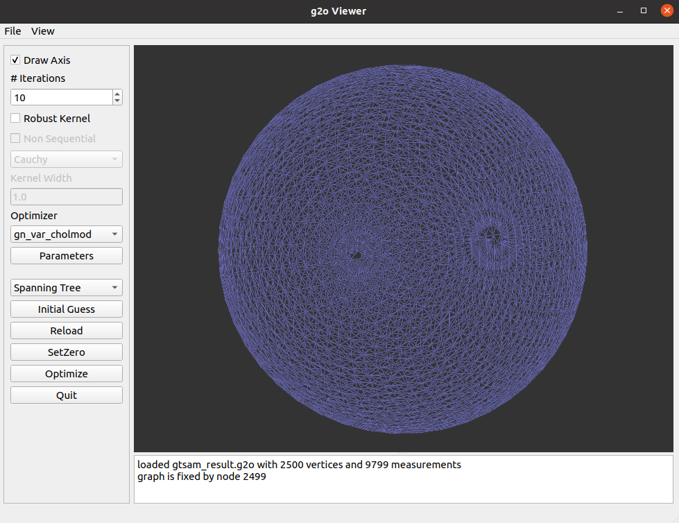

# slam14-ch10-ceres

视觉slam14讲（第二版）ch10 位姿图优化ceres实现版本

pose_graph_ceres.cpp 为ceres李代数实现版本

pose_graph_ceres_quaternion.cpp 为ceres四元数实现版本

pose_graph_gtsam.cpp 为GTSAM实现版本

## 运行方式
```
mkdir results
mkdir build &&  cd build
cmake ..
make
./pose_graph_ceres
./pose_graph_ceres_quaternion
./pose_graph_gtsam
```

## 查看优化结果
```
cd results
g2o_viewer XXX_result.g2o
```
